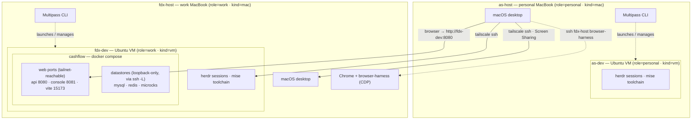
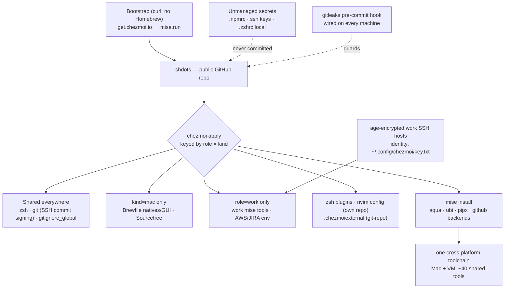

# shdots

Personal + work dotfiles, managed with [chezmoi](https://chezmoi.io). One source
serves four machine classes, selected at init by two answers:

| data   | values            |
|--------|-------------------|
| `role` | `personal` \| `work` |
| `kind` | `mac` \| `vm`      |

## Bootstrap a new machine

Two cross-platform `curl` one-liners — no Homebrew required (`curl` ships on macOS
and is installed by the VM's cloud-init):

> **Step 0 — age key.** Every class decrypts at least one file
> (`~/.config/op/env`), so `init --apply` aborts on a box without the identity.
> Provision it first, from any existing machine (the new box has no tailscale
> yet, so push from an old one, or use a USB stick / password manager):
>
> ```sh
> # on an existing machine, to the new box's reachable address
> ssh <new-box> 'mkdir -p ~/.config/chezmoi'
> scp ~/.config/chezmoi/key.txt <new-box>:~/.config/chezmoi/key.txt
> ```
>
> **Step 0b — SSH keys.** `~/.ssh/id_*` are unmanaged; generate or copy the
> per-class key (`id_rsa`, `id_ed25519`, `id_ed25519_personal`,
> `id_ed25519_foodics`) before committing anywhere — `git commit` signs with it
> (`gpgsign = true`) and fails loudly until it exists.

```sh
# 1. chezmoi installs itself and applies this repo (prompts for role + kind)
sh -c "$(curl -fsLS get.chezmoi.io/lb)" -- init --apply shahwan42/shdots

# 2. mise is installed automatically by run_once_before_00-install-mise.sh
#    (curl https://mise.run | sh) and the toolchain is provisioned by
#    run_onchange_after_20-mise-install.sh (mise install).
```

**Creating the box first, if it's a VM.** Dev VMs come from one cloud-init file plus a
launcher, run on the Mac that will own the VM:

```sh
cd ~/.local/share/chezmoi/provision
./launch-dev-vm.sh as-dev                              # personal VM — 6 cpu / 12G / 220G
./launch-dev-vm.sh fdx-dev                             # work VM — same spec
```

That handles everything unattended — Docker, Tailscale, Eternal Terminal, zsh, mise, staged
ufw rules — and prints the interactive remainder (tailscale auth, age key, SSH key,
`GITHUB_TOKEN`, then the two commands above). See `provision/README.md`.

After apply, open a fresh login shell. On a Mac, install Homebrew first if the
machine is truly fresh (`/bin/bash -c "$(curl -fsSL https://raw.githubusercontent.com/Homebrew/install/HEAD/install.sh)"`),
then run `brew bundle --file=~/Brewfile` once for the native/GUI packages that
stay outside mise (including `op` via the `1password-cli` cask — the op env file
is unusable on a Mac until then).

### When things run

| Step | Trigger |
|------|---------|
| `run_once_before_00-install-mise.sh` | once per machine, before files are applied |
| file apply (age decryption, externals) | every `chezmoi apply` |
| `run_once_after_10-configure-git-hooks.sh` | once per machine, after files (wires the gitleaks hook) |
| `run_onchange_after_20-mise-install.sh` | whenever `~/.config/mise/config.toml` changes (script embeds its sha256) |
| `run_onchange_after_30-schedule-autoupdate.sh` | whenever the launchd plist or systemd units change (script embeds their sha256s) |
| `run_onchange_after_40-claude-mcp-sync.sh` | whenever the script changes (it *is* the Claude MCP declaration) |
| `run_onchange_after_41-opencode-mcp-sync.sh` | whenever the script changes (upserts OpenCode MCP servers into `opencode.jsonc`) |
| `run_onchange_after_43-codex-mcp-sync.sh` | whenever the script changes (reconciles Codex MCP servers into `~/.codex/config.toml`) |

### Auto-update

Every machine pulls and applies this repo on its own every **6 hours** — launchd on
Macs, a systemd user timer on VMs, both running `~/.local/bin/chezmoi-autoupdate`.
It fast-forwards only when that is provably safe and otherwise writes
`~/.cache/chezmoi-stale`, which zshrc surfaces as a one-line warning. Practical
consequence: **a push to `main` deploys fleet-wide within 6 hours.**

zsh-plugin externals refresh at most every **168h**; the `~/.config/nvim` external
(`shahwan42/nvim-config`) has `refreshPeriod = 0`, so every apply/update runs `git pull`
in it. Force a full refresh of all externals with `chezmoi apply --refresh-externals`.

> **`GITHUB_TOKEN`**: mise's `github:`/`ubi:` backends call the GitHub API, which is
> rate-limited to 60/hr unauthenticated — a full `mise install` will 403 partway.
> Put a read-only PAT in the unmanaged **`~/.zshrc.local`** (where machine-local
> secrets already live), which the shell sources:
>
> ```sh
> export GITHUB_TOKEN="$(op read 'op://dev-secrets/GitHub PAT/token')"
> [ -n "$GITHUB_TOKEN" ] || unset GITHUB_TOKEN   # empty guard: never export ""
> ```
>
> `mise install` then picks it up from the environment. The `aqua:`/`core:`/`pipx:`
> tools install fine without it.

### Tool versions are locked

`dot_config/mise/mise.lock` pins exact versions, URLs, and checksums for the whole
fleet (all platforms in one lock); the version strings in the config stay `latest` —
the lock is what pins. Upgrade flow: `mise up` on one machine → copy the changed
`~/.config/mise/mise.lock` back over `dot_config/mise/mise.lock` in the source →
commit/push → fleet converges within 6 h. An un-copied lock change shows up as
`chezmoi status` drift (and the stale-marker warning) until it lands in the source.

## Machine topology

Two Macs, each hosting one Multipass dev VM, all four first-class Tailscale nodes
reaching each other by tailnet name. The VMs mirror each other in shape — same cloud-init,
same mise toolchain — and differ only by `role`, which is what keeps work tooling and work
SSH hosts off the personal box. Inside `fdx-dev`, the cashflow stack binds web ports to the
tailnet but keeps datastores on loopback.



## How every machine gets provisioned

One public repo, one `chezmoi apply`; the `role × kind` answers decide what each machine
receives. The cross-platform CLI toolchain comes from mise (shared), Homebrew is trimmed
to Mac-only natives and GUIs, and the zsh plugins plus the Neovim config are pulled as
chezmoi externals (the latter from its own repo, `shahwan42/nvim-config`).



## How installs are split

- **mise** (`~/.config/mise/config.toml`) — the cross-platform CLI toolchain, shared
  across all machines (a `role=work` block adds work-only tools). Prefer this for any
  new tool. Uses `aqua:`/`ubi:`/`github:` backends (prebuilt binaries).
- **Homebrew** (`Brewfile`, macOS only) — only behavior-sensitive natives (GNU
  coreutils, ffmpeg), system services (nginx, dnsmasq, docker), GUI apps/casks, and
  the PHP/iOS stack. Not the general CLI toolchain.
- **chezmoi externals** (`.chezmoiexternal.toml`) — content pulled straight from git,
  identically everywhere: zsh plugins into `~/.local/share/zsh/plugins` (refreshed at
  most every 168h), and the Neovim config into `~/.config/nvim` from its own repo
  [`shahwan42/nvim-config`](https://github.com/shahwan42/nvim-config) (`refreshPeriod = 0`,
  so every `chezmoi apply`/`update` runs `git pull` there). Edit nvim in place and push
  to that repo; shdots only points at it.
- **PHP / composer** — on Macs, kept native (Homebrew `php@8.3`), not routed through mise,
  so the extension matrix comes ready-built. The VMs carry no host PHP: Laravel/PHP work
  there runs in Docker Compose / Sail.

[herdr](https://herdr.dev) — the terminal multiplexer — is just another shared mise
tool (`aqua:herdrdev/herdr`), the same on Mac and VM.

Remote shells use [Eternal Terminal](https://eternalterminal.dev) (`et fdx-host`,
`et fdx-dev`): it authenticates over plain SSH (aliases and keys carry over), then
survives sleep, IP changes, and outages on TCP :2022. Macs get it from the Brewfile
(`brew services start mistertea/et/et` on machines that accept connections; the
user-level service starts at login); the VMs run the `et` systemd service from
`ppa:jgmath2000/et`, installed by `provision/dev-vm-cloud-init.yaml`. et keeps the
connection alive; herdr keeps the sessions alive.

## Secrets & the work SSH sync

Never committed: `~/.npmrc`, `~/.ssh/id_*`, `~/.zshrc.local` (machine-local exports),
and per-host SSH config. A gitleaks pre-commit hook is wired on every machine by
`run_once_after_10-configure-git-hooks.sh`.

Age encryption is enabled on **every** machine class. The decryption identity lives,
unmanaged, at `~/.config/chezmoi/key.txt` — provision it once per machine (copy from an
existing machine over the tailnet), then `chezmoi init` picks up the encryption config.
Role guards decide *what* decrypts *where*:

- Work SSH hosts (bastion + internal staging) — `role=work` only; personal machines
  ignore the encrypted file entirely.
- 1Password service-account token (`~/.config/op/env`) — all machines. Sourced by
  `.zshrc`, it makes `op read op://dev-secrets/<item>/<field>` and
  `op run --env-file … -- <cmd>` work headless (no GUI unlock, no `op signin`) — the
  runtime-secrets layer for agents and scripts. The service account is read-only and
  scoped to the `dev-secrets` vault; rotate/revoke it from the 1Password web console.
  Macs get `op` from the `1password-cli` cask, VMs from mise (`vfox:mise-plugins/vfox-1password`).

> This repo is **public**. Anything genuinely secret stays unmanaged or age-encrypted;
> enable GitHub secret-scanning push protection as a backstop.

## Troubleshooting a fresh machine

- **`chezmoi apply` fails at `.config/op/env` with an age error** — the identity
  `~/.config/chezmoi/key.txt` is missing. See Bootstrap step 0, then re-run
  `chezmoi init --apply shahwan42/shdots`.
- **`git commit` fails with a missing-key error** — commit signing is on
  everywhere and the per-class `~/.ssh/id_*` key is unmanaged; generate/copy it
  (Bootstrap step 0b).
- **`chezmoi apply` errors on `~/.config/nvim`** — it is a `git-repo` external
  ([`shahwan42/nvim-config`](https://github.com/shahwan42/nvim-config)), not
  chezmoi source. On a fresh box chezmoi clones it over HTTPS; if the directory
  already exists from an unrelated Neovim install, move it aside and re-apply.
  Local edits there are committed and pushed to that repo, not to shdots.
- **`mise install` 403s or skips tools** — GitHub API rate limit; set
  `GITHUB_TOKEN` (see above) and re-run `mise install`. The apply script is
  non-fatal on purpose, so a bootstrap can *look* complete — check
  `mise ls --missing` after any fresh install.
- **A single ubi/aqua tool won't resolve** — run `mise install <tool>` alone for
  the real error; ubi needs a release asset matching your OS/arch and aqua's
  registry can lag a release. Pin a version or switch backends.
- **Fresh Mac: compilers/git missing before Brewfile** — run
  `xcode-select --install`; the chezmoi bootstrap needs only curl, but Homebrew
  and some builds need the CLT.
- **`et fdx-*` / ssh aliases can't resolve** — tailnet names go stale when a
  node is re-registered; check `tailscale status`. Work hosts live in the
  age-encrypted `~/.ssh/config.d/foodics`.
